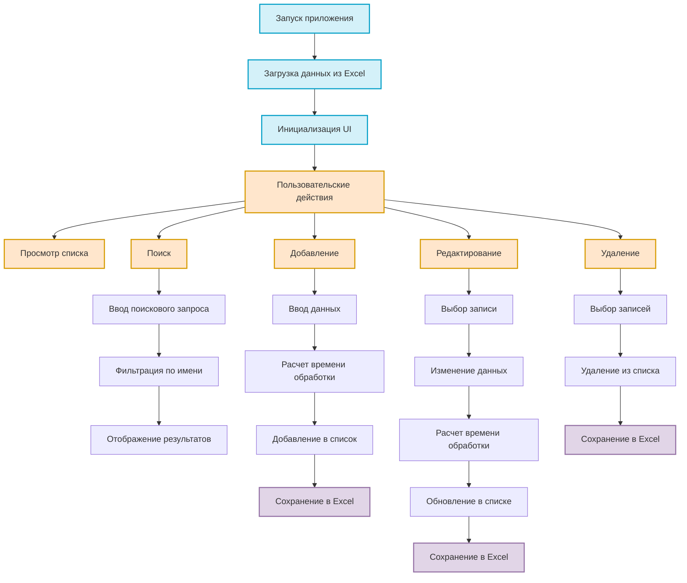

<p align="center">
  
</p>

<p align="center">
  <a href="https://github.com/Mr-Cheen1/go-reg-wails/actions/workflows/lint.yml"></a>
  <a href="https://github.com/Mr-Cheen1/go-reg-wails/actions/workflows/test.yml"></a>
  <a href="https://github.com/Mr-Cheen1/go-reg-wails/actions/workflows/build.yml"></a>
</p>

# 📊 Desktop Go Reg (Wails + React)

Приложение для учета и расчета времени обработки деталей с современным веб-интерфейсом, написанное на Go (бэкенд) и React с TypeScript (фронтенд) с использованием фреймворка Wails.

## 🚀 Возможности

- ✨ Добавление, редактирование и удаление записей
- 🔍 Поиск по наименованию
- ⏱️ Расчет времени обработки с поддержкой формул (например: 8+2+5)
- ✅ Множественное выделение записей для удаления
- 💾 Автоматическое сохранение в Excel файл
- 🎨 Современный адаптивный интерфейс с темной темой
- 🖥️ Кроссплатформенность (Windows, macOS, Linux)
- 🧪 Полное покрытие тестами бэкенд-части

## 📥 Установка

### Требования

- Go 1.22 или выше
- Node.js 18 или выше
- Wails CLI v2

### Установка Node.js (Windows)

Для Windows можно использовать скрипт автоматической установки:

```powershell
.\install-nodejs.ps1
```

### Установка Wails CLI

```bash
go install github.com/wailsapp/wails/v2/cmd/wails@latest
```

### Сборка из исходного кода

1. Клонируйте репозиторий:

```bash
git clone https://github.com/Mr-Cheen1/go-reg-wails.git
cd go-reg-wails
```

2. Установите зависимости и соберите приложение:

```bash
wails build
```

### Разработка

Для запуска в режиме разработки:

```bash
wails dev
```

### Тестирование

Для запуска всех тестов:

```bash
go test ./... -v
```

Для проверки покрытия кода тестами:

```bash
go test ./... -cover
```

## 🏗️ Структура проекта

```
go-reg-wails/
├── 📁 backend/                # Бэкенд на Go
│   ├── 📁 models/            # Модели данных
│   │   ├── product.go       # Структура продукта и методы работы с ним
│   │   └── product_test.go  # Тесты для продуктов
│   ├── 📁 storage/           # Слой хранения данных
│   │   ├── excel.go         # Работа с Excel файлом
│   │   ├── storage.go       # Интерфейс хранилища
│   │   └── excel_test.go    # Тесты для хранилища
│   └── 📁 utils/             # Вспомогательные функции
│       ├── calculator.go    # Калькулятор времени
│       └── calculator_test.go # Тесты для калькулятора
├── 📁 build/                  # Ресурсы сборки
│   ├── appicon.png          # Иконка приложения
│   ├── 📁 bin/              # Скомпилированные файлы
│   │   ├── go-reg-wails.exe # Исполняемый файл
│   │   └── database.xlsx    # Файл базы данных
│   └── 📁 windows/          # Windows-специфичные ресурсы
├── 📁 frontend/               # Фронтенд на React
│   ├── 📁 src/               # Исходный код React
│   │   ├── 📁 components/   # React компоненты
│   │   │   ├── 📁 ui/       # UI компоненты (Radix UI)
│   │   │   ├── AddProductDialog.tsx
│   │   │   ├── EditProductDialog.tsx
│   │   │   ├── ProductTable.tsx
│   │   │   └── Toaster.tsx
│   │   ├── 📁 hooks/        # React хуки
│   │   │   └── use-toast.ts
│   │   ├── 📁 lib/          # Утилиты
│   │   │   └── utils.ts
│   │   ├── App.tsx          # Основной компонент приложения
│   │   ├── main.tsx         # Точка входа
│   │   └── index.css        # Глобальные стили
│   ├── 📁 wailsjs/          # Автогенерируемые биндинги Wails
│   ├── package.json         # Зависимости NPM
│   ├── tailwind.config.js   # Конфигурация Tailwind CSS
│   ├── tsconfig.json        # Конфигурация TypeScript
│   └── vite.config.ts       # Конфигурация Vite
├── 📁 .github/workflows/     # CI/CD конфигурация
├── 📝 app.go                 # Логика приложения
├── 📝 app_test.go            # Тесты для логики приложения
├── 📝 main.go                # Точка входа в приложение
├── 📝 go.mod                 # Go модули
├── 📝 go.sum                 # Контрольные суммы зависимостей
├── 📝 wails.json             # Конфигурация Wails
├── 📝 install-nodejs.ps1     # Скрипт установки Node.js (Windows)
└── 📖 README.md              # Документация
```

## 🔧 Технологии

### Бэкенд

| Технология | Версия | Описание |
|------------|--------|----------|
| **Go** | 1.22+ | Основной язык программирования |
| **Wails** | v2.10.1 | Фреймворк для создания десктопных приложений |
| **excelize** | v2.9.0 | Библиотека для работы с Excel файлами |

### Фронтенд

| Технология | Версия | Описание |
|------------|--------|----------|
| **React** | 18.2.0 | Библиотека для создания пользовательского интерфейса |
| **TypeScript** | 5.4.2 | Типизированный JavaScript |
| **Vite** | 5.1.6 | Инструмент сборки |
| **Tailwind CSS** | 3.4.1 | Утилитарный CSS-фреймворк |
| **Radix UI** | - | Примитивы для UI компонентов |
| **Lucide React** | 0.363.0 | Библиотека иконок |

## 🔄 Логика работы приложения



## 📝 Лицензия

Copyright © 2025

## 🔄 CI/CD

Проект использует GitHub Actions для автоматизации следующих процессов:

- 🔍 **Линтинг**: Проверка качества кода с помощью golangci-lint
- 🧪 **Тестирование**: Запуск всех тестов
- 📦 **Сборка**: Компиляция приложения для Windows

Статус процессов можно увидеть в бейджах вверху README.
